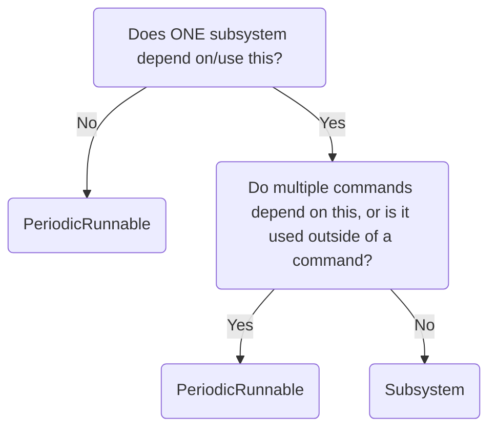

# PeriodicRunnable class
PeriodicRunnable is for systems that need to be run periodically, but do not need to be full subsystems.
## Decision flowchart


## Code example
```java
class Example extends PeriodicRunnable {
  public Example() {
    super(); // Super call adds it to the registry, which calls the periodic method every tick
  }
  @Override
  public void periodic() {
    //Periodic functionality
  }
}
```
